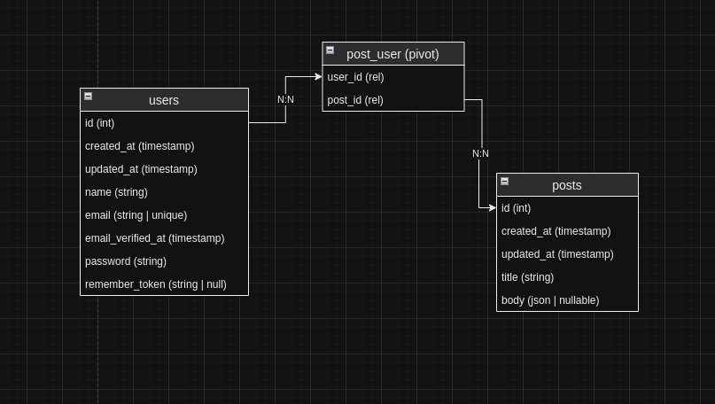

## About project
What is Project?
 
This project test task for Backend developer.
### Stacks
1. <a href="https://www.php.net/releases/8.1/en.php" target="_blank">PHP-8.1.3v<a/>. Framework <a href="https://laravel.com/docs/9.x/releases#laravel-9" target="_blank">Laravel 9</a>.
2. <a href="https://dev.mysql.com/downloads/mysql/5.7.html" taget="_blank">MySQL 5.7</a>.
3. <a href="https://nginx.org/en/download.html">Nginx-latest</a>.
### Installation guide
Before installation set up your <a href="https://docs.github.com/en/authentication/connecting-to-github-with-ssh/generating-a-new-ssh-key-and-adding-it-to-the-ssh-agent" target="_blank">SSH keys on Github</a> and <a href="https://docs.docker.com/engine/install/ubuntu/" target="_blank">Docker</a>.
 
### Steps (with Docker):
``$ git clone git@github.com:xkas01/Abdigital.git``
 
``$ cd Abdigital``
 
``$ cp .env.example .env``
 
``$ docker-compose up --build -d``
 
Also our system have dashboard for database (phpMyAdmin).
 
``$ open http://localhost:1051``
 
Username: ``abdigital``
 
Password: ``abdigital``
 

### Docker container's shell
PHP:
 
``$ docker exec -it php-abdigital /bin/sh``
 
Database:
 
``$ docker exec -it database-abdigital /bin/sh``

### Documentation for API
Local URL:
 
``abdigital/docs/Abdigital.postman_collection.json``
 
Aritsan command for regenerate:
 
1. ``$ docker exec -it php-abdigital /bin/sh``
2. ``$ php artisan migrate:refresh --seed``
3. Simple one line command: ``$ docker exec -it php-abdigital php artisan migrate:refresh --seed``

## <a href="https://dev.to/dotmarn/how-to-send-application-logs-to-telegram-in-laravel-1l12" target="_blank">Laravel error logging + Telegram bot<a/>
### .env
- TELEGRAM_API_KEY = "Your bot token"
- TELEGRAM_CHANNEL = "@Your_channel_name"

## Structure of Database

